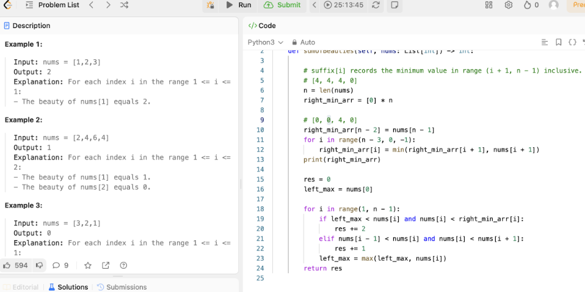
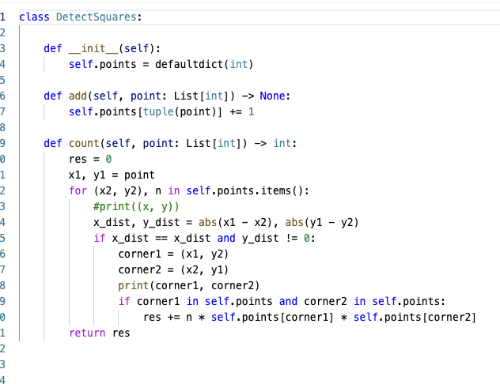

<h2>My Databases Class</h2>

Everything I learned from DB Class...

<h2>My Cloud Computing Class</h2>

Everything I learned from Cloud Computing...

<h2>Open Source Development</h2>

Everything I learned from Open Source Development...

<h2>My Leet-Code Cheat Sheet</h2>

Total Contest Comprehended: 2

<h3>Beauty-in-the-array</h3>

In thos problem, I made a suffix right sum to track the min value. 

<h3>Detect-Square</h3>

In thos problem, I see if correct diagonal point exists

<h2>My Applications</h2>

Currently Applied to: 2 places

